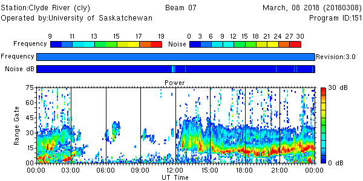
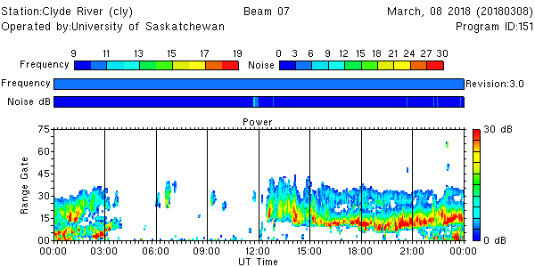

<!--
(C) copyright 2022 University Centre in Svalbard (UNIS)
author: Emma Bland, UNIS

This file is part of the Radar Software Toolkit (RST).

RST is free software: you can redistribute it and/or modify
it under the terms of the GNU General Public License as published by
the Free Software Foundation, either version 3 of the License, or
(at your option) any later version.

This program is distributed in the hope that it will be useful,
but WITHOUT ANY WARRANTY; without even the implied warranty of
MERCHANTABILITY or FITNESS FOR A PARTICULAR PURPOSE.  See the
GNU General Public License for more details.

You should have received a copy of the GNU General Public License
along with this program.  If not, see <https://www.gnu.org/licenses/>.

Modifications:
-->
# Despecking fitacf files

Hardware and operational factors sometimes affect the noise level estimation in FitACF, resulting in contamination of the fitted data with "salt and pepper noise". 

This contamination can be identified in range-time plots as data points that are isolated in range and time:


The `fit_speck_removal` routine is designed to remove these isolated points from the fitted data. Despecking is performed separately for each beam and each channel. The output is a fitacf file with the salt and pepper noise removed, but otherwise identical to the input file. 

## Usage

After generating a `fitacf` file using `make_fit`, the despecking routine can be applied as follows:

```
fit_speck_removal [inputfile].fitacf > [outputfile].despeck.fitacf
```

You can view the data before and after despecking using a range-time plot, for example:

```
time_plot -x -a -b 7 [inputfile].fitacf               # before despecking
time_plot -x -a -b 7 [outputfile].despeck.fitacf      # after despecking
```


## Considerations for use

Users are encouraged to view the fitted data before applying the despecking procedure. Note that `fit_speck_removal` is likely to remove considerable amounts of **meteor scatter** and other small populations of backscatter that have a limited temporal and spatial extent. 

It is also not recommended to use this routine with **multi-frequency data** that have not been separated into different frequency channels (e.g., **two-frequency data** from SAS, PGR, RKN, INV and CLY generated before December 2016).


## Example

The plots below show the fitted data before and after the despecking procedure. Notice that the isolated points in range gates ~40 and above have been removed, as well as a large amount of the meteor scatter at near ranges. 

**Before despecking:**


**After despecking:**


