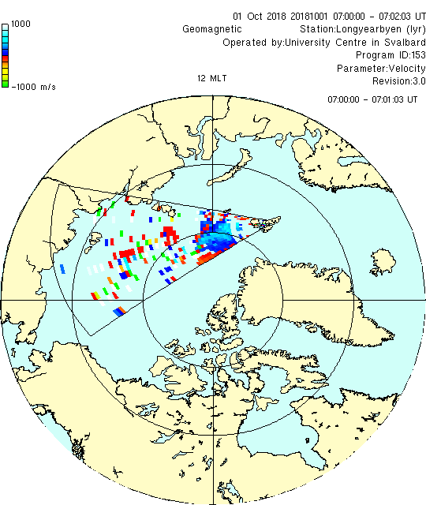

<!--
(C) copyright 2019 University Centre in Svalbard (UNIS)
author: Emma Bland, UNIS
-->
# Fan plots

To generate a fan plot we use the routine `field_plot`. The source code can be found in `$RSTPATH/codebase/superdarn/src.bin/tk/plot/field_plot.X`

## Getting started
These are the minimum options required to get a sensible output:

```
field_plot -x -v -coast -fan -keyp -tl 60 20181001.0601.00.lyr.fitacf
```

*For some radars, the `-tl 60` option is required due to an issue with the scan flag*

## More customization options
Here is an example incorporating a wider number of options:
```
field_plot -png \
-v -vmin -1000 -vmax 1000 -keyp \
-coast -fcoast \
-fterm -ftrmcol 44000000 \
-fan -fancol FF000000 \
-lndcol FFFFFCC7 -seacol FFD0FFF9 -cstcol FF000000 \
-mag -latmin 60 -lat 90 -lon 0 -grdontop  \
-rotate -tmk -tmlbl \
-r 1 -st 07:00 -time \
-tl 60 \
20181001.0601.00.lyr.fitacf > fieldplot.png
```



## Generate multiple frames for a movie
You can use a single command to create multiple frames with the `-r 0` option. This generates multiple output files with file names in chronological order (`-dn` generates timestamped filenames). 
```
field_plot -png -tl 60 -cn A 
-v -vmin -1000 -vmax 1000 -keyp \
-rotate -tmk -tmlbl -time \
-grd -grdontop \
-r 0 -dn  \
20181001.0601.00.lyr.fitacf
```

*You can then combine these frames into a movie using another program such as `ffmpeg` or `ImageMagick`*
