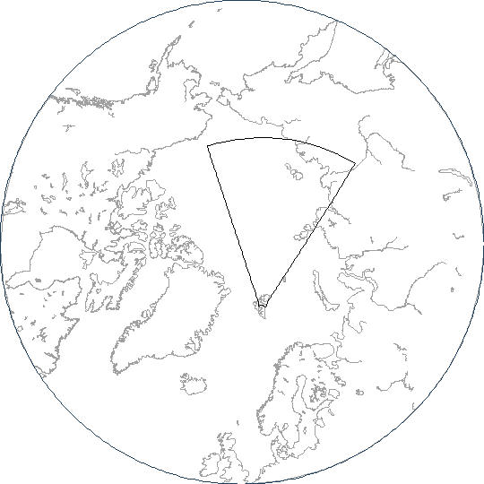
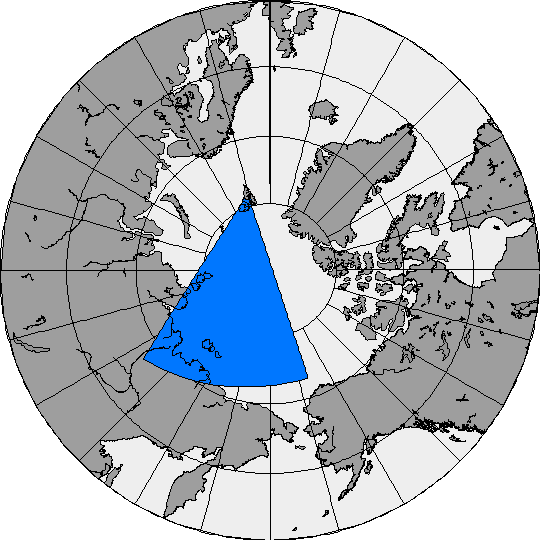
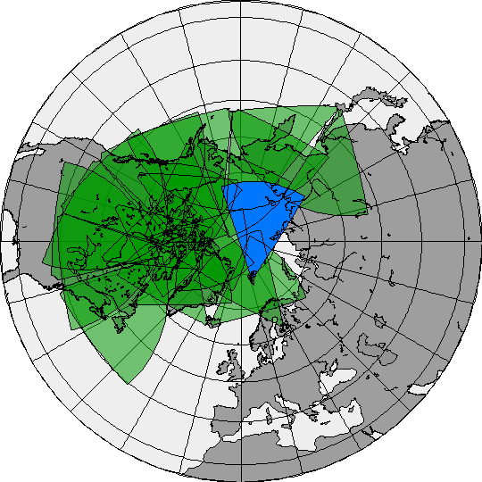
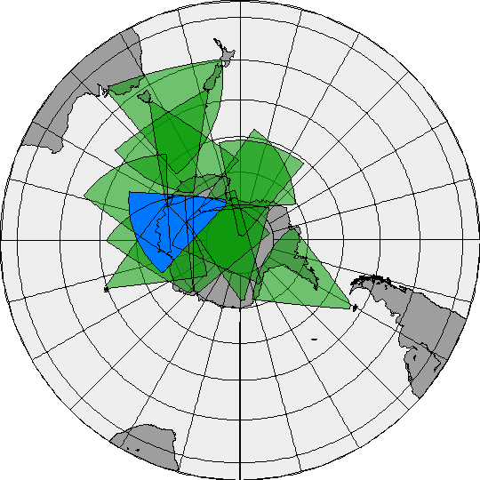

<!--
(C) copyright 2019 University Centre in Svalbard (UNIS)
author: Emma Bland, UNIS
-->
# Radar field of view plots
The `fov_plot` function plots the fields of view of SuperDARN radars onto a map. It does not plot any data.

## Getting started
```
fov_plot -x -stereo -coast -fov -st lyr -d 20181001
```



All of the above flags are necessary to obtain an informative figure:

- `-x` Display the figure in an X-terminal
- `-stereo` Use a stereographic projection. One alternative is the orthographic projection (\inlinecode{-ortho})
- `-coast` Plot coast outlines
- `-fov` Plot the field of view outline for the radar specified by the \inlinecode{-st} flag
- `-st` Used to specify which radar to plot (3-letter station name, not the numerical ID code). If omitted, the Goose Bay (gbr) radar is plotted by default
- `-d` Read the radar hardware file that was in use on the date YYYYMMDD (if this date is before the radar was operational, the FOV won't be displayed)


## Add colour and coordinate grid, output as png
```
fov_plot -d 20181001 -t 12:00 -rotate \
-st lyr -fov -ffov \
-stereo -grd -latmin 50 \
-coast -fcoast  \
-ffovcol FF0077FF -grdcol FF000000 \
-cstcol FF000000 -lndcol 55000000 -seacol 11000000 \
-png > lyr_fovplot.png
```


The `-rotate` flag rotates the plot so that local noon is at the top of the figure. Since we have specified `-t 12:00`, the radar is displayed in its position at 12:00 UT.


## Plot fields of view of all radars
The fields of view of all radars in the northern or southern hemisphere can be plotted by making use of the `-ofov` ('other fields of view') and/or `-fofov` ('fill other fields of view') options. If you want all the radars shaded the same colour, remove the `-st`, `-fov` and `-ffov` flags.


### Northern Hemisphere
```
fov_plot -x -d 20181001 -t 00:00 -rotate \
-st lyr -fov -ffov -ofov -fofov \
-stereo -grd -latmin 20 -lat 90 -lon 0 \
-coast -fcoast \
-ffovcol FF0077FF -fofovcol 88009900 -grdcol FF000000 \
-cstcol FF000000 -lndcol 55000000 -seacol 11000000
```



### Southern Hemisphere 
```
fov_plot -x -d 20181001 -t 00:00 -rotate \
-st mcm -fov -ffov -ofov -fofov \
-stereo -grd -latmin 20 -lat -90 -lon 0 \
-coast -fcoast \
-ffovcol FF0077FF -fofovcol 88009900 -grdcol FF000000 \
-cstcol FF000000 -lndcol 55000000 -seacol 11000000
```



