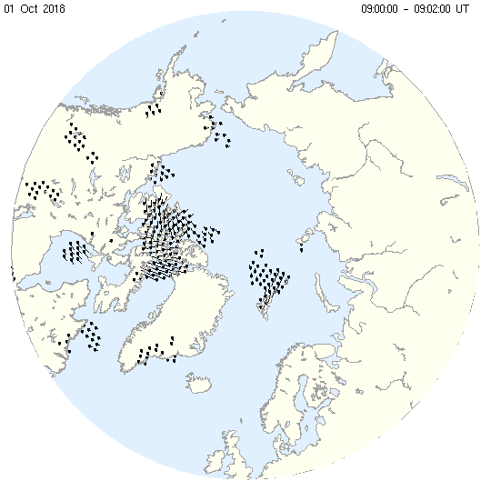
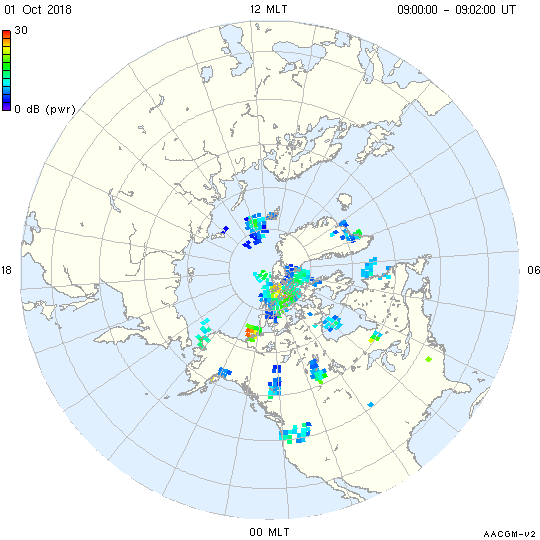
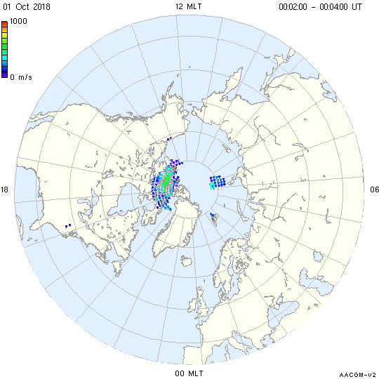

<!--
(C) copyright 2019 University Centre in Svalbard (UNIS)
author: Emma Bland, UNIS
-->
# Hemisphere plots of gridded parameters


## Getting started
```
grid_plot -x -delay 0 -raw -st 09:00 -time -coast -fcoast 20181001.north.grd
```

This code plots gridded line-of-sight ("raw") velocity vectors onto a map. 

- `-x` plot the data in an X-terminal
- `-delay 0` pause the frame until a mouse button is pressed, then the next interval will be plotted. Use `Ctrl+C` to exit. 
- `-raw` plot raw line-of-sight velocity vectors
- `-st 09:00` generate plots beginning at time 09:00UT
- `time` display the date and time in the figure window
- `-coast` draw coast outlines
- `-fcoast` fill the continents with default colors



## Plotting gridded power or spectral width

Grid files generated using the `-xtd` option in `make_grid` include the power and spectral width parameters in addition to the line-of-sight and merged velocity vectors. You can plot the power and spectral width using the `-pwr` and `-swd` options respectively.

Example: 
```
grid_plot -png -ex 00:02 -st 09:00 \
          -coast -fcoast -rotate -latmin 30 -mag -grd -grdontop -tmlbl -time \
          -pwr -pmax 30 -xkey rainbow.key -xkeyp \ 
          20181001.north.grid2 
```




## Multi-plot time-series
The `grid_plot` routine can also output a series of plots which can then be combined into a movie. For example, 

```
grid_plot -png \
          -coast -fcoast -rotate -latmin 30 -mag -grd -grdontop -tmlbl -time \
          -raw -vkey myRSTvelcolorkey.key -vkeyp \ 
          20181001.north.grid2
```



