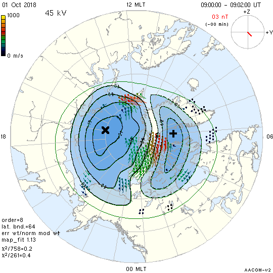

<!--
(C) copyright 2019 University Centre in Svalbard (UNIS)
author: Emma Bland, UNIS
-->
# Convection maps

Convection maps can be plotted using the `map_plot` routine. 

## Example plot
```
map_plot -png \ 
         -coast -fcoast -mag -grd -grdontop \
         -ctr -poly -fpoly -fpolycol 554090DD \
         -extra -fit -rotate -hmb -imf -tmlbl -maxmin -pot -latmin 50 \
         -vecp -vkeyp -vkey blue+green+red+yellow.key -vsf 3 \
         -frame -dn -st 09:00 -time 20181001.north.map2
```



- `coast` plot coast outlines
- `fcoast` fill the coastlines
- `mag` use magnetic coordinates
- `grd` plot the coordinate grid
- `grdontop` plot the grid on top of the mapped data
- `-ctr` plot the potential contours
- `-poly` plot the contour lines as polygons
- `-fpoly` fill the contour lines 
- `-fpolycol 554090DD` set the color of filled contour polygons
- `-extra` plot extra diagnostic information
- `-fit` plot the fitted two-dimensional velocity vectors
- `-rotate` rotate the plot so that the local noon is at the top
- `-hmb` plot Heppner-Maynard boundary
- `-imf` plot the IMF clock-dial
- `-tmlbl` label the time clock-dial
- `-maxmin` plot the points of maximum and minimum potential
- `-pot` plot the cross polar cap potential
- `-latmin 50` adjust the scale factor so that the lowest visible latitude is 50 degrees
- `-vecp` plot the example vector
- `-vkeyp` plot the color key for the velocity scale
- `-vkey blue+green+red+yellow.key` specify which velocity color key to use
- `-vsf 3` set the vector scale factor to 3
- `-frame` add a frame around the borders of the plot
- `-dn` generate filenames of the form yyyymmdd.hrmn.sc.xxx
- `-st 09:00` generate plots starting at 09:00UT
- `time` plot the time of the plotted data

Type `map_plot --help` into the terminal to view all of the available input options. 
