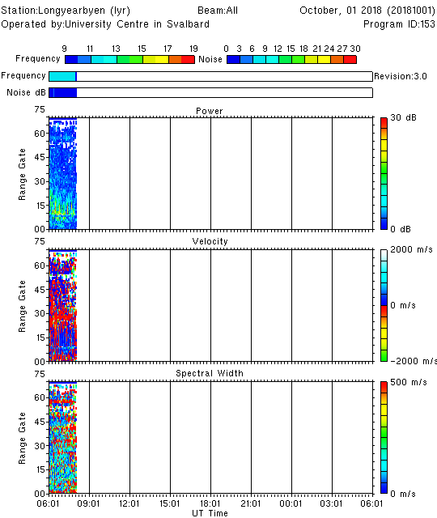

The RST plotting routines should have been added to your path during installation, but you can find them in `$RSTPATH/bin`. You can view the available input options for each routine using, for example
```
time_plot --help
field_plot --help
fov_plot --help
```

Further examples for each function can be found in `$RSTPATH/codebase/superdarn/src.bin/tk/plot/[function_name]/doc/[function_name].doc.xml`

In RST you have the option to plot the data in an X-terminal, or save the plot to an image file. For example, 
```
# Display plot in X-terminal
time_plot -x [filename].fitacf

# Produce PostScript plot as output    
time_plot -ps [filename].fitacf > [filename].ps

# Produce Portable Network Graphics (PNG) image as the output
time_plot -png [filename].fitacf > [filename].png
```


# Range time plots

## Getting started
```
time_plot -x -a 20181001.0601.00.lyr.fitacf
```
*An X-window showing a SuperDARN range-time plot should open.*

Let's take a look at what each option means:

- `-x` Plot the data in an X-terminal
- `-a` Plot all parameters (power, velocity, spectral width). You can plot the elevation angles by adding `-e`





By default, the time axis spans 24 hours, but we have supplied a 2-hour `fitacf` file. To change the axis range to suit the time span of the input data, you have two options:

1. Specify the interval length in the format `-ex HH:MM`
2. Provide the start and end times for the time axis: `-st HH:MM -et HH:MM`

```
time_plot -x -a -ex 02:00 20181001.0601.00.lyr.fitacf
time_plot -x -a -st 06:00 -et 08:00 20181001.0601.00.lyr.fitacf
```

## 24-hour plot
Most often you will want to plot data spanning more than two hours. To achieve this, you first need to concatenate the required `fitacf` files into a single file. With this new input file you should obtain the more familiar 24-hour range-time plot:

```
cat 20181001.*.lyr.fitacf > 20181001.lyr.fitacf
time_plot -x -a 20181001.lyr.fitacf
```


## More customization options
A full list of options for customizing the range-time plots is available by typing `time_plot --help`, but here are a few common examples to get started. Many options can be combined together.

**Plot only the data from channel A, beam 7**
```
time_plot -x -a -c A -b 7 20181001.lyr.fitacf
```


**Plot only the velocity parameter, and change the range of the color key**
```
time_plot -x -v -vmin -500 -vmax 500 20181001.lyr.fitacf
```

**Mark the ground scatter**
```
time_plot -x -a -gs 20161010.lyr.fitacf
```

**Use units of kilometers for the range axis (i.e. slant range) instead of gate number, and specify the y-axis range and major/minor tick intervals:**
```
time_plot -x -a -km -ymajor 500 -yminor 100 -frang 0 20181001.lyr.fitacf
```

**Plot magnetic latitude instead of range (or use `-geo` for geographic latitude)**
```
time_plot -x -a -mag -latmin 72 -latmax 85 -b 0 -c A 20181001.lyr.fitacf
```


**Create a PostScript output of the plot**
```
time_plot -ps -a -xp 0 -yp 0 20181001.lyr.fitacf > timeplot.ps
```
*The `-xp 0` and `-yp 0` arguments may be required for the plot to fit onto the page correctly.*

**Create a Portable Network Graphics (PNG) output of the plot**
```
time_plot -png -a 20181001.lyr.fitacf > timeplot.png
```
